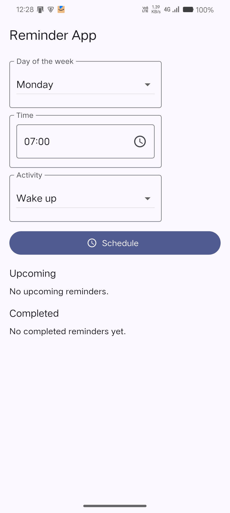

# Reminder App (Flutter)

Simple reminder application built with Flutter for the internship task.

### Features
- Day-of-week selector, time picker, and activity dropdown (dropdown-only UI).
- Schedules a local notification with a chime at the selected time.
- Upcoming list showing future reminders.
- Completed list that automatically records reminders at the due time.
- Delete actions for both upcoming and completed entries.

### Requirements
- Flutter SDK 3.27+ (tested on 3.29.x)
- Dart 3.7+
- Android 8.0+ (Oreo) or iOS 13+ recommended

### Setup
1. Clone the repository and fetch packages:
   ```bash
   flutter pub get
   ```
2. Ensure an Android/iOS device or emulator is available:
   ```bash
   flutter devices
   ```
3. Run the app:
   ```bash
   flutter run
   ```

### Permissions (Android)
- The app requests Notification permission on first launch.
- On Android 12/13+, enable exact alarms if you want precise delivery (Settings → Apps → Special access → Alarms & reminders → Allow for app). The app will still schedule one-shot notifications without this, but delivery can be inexact on some OEMs.

### Scheduling behavior
- Each reminder is scheduled once (one‑shot). At the due time:
  - A notification appears with sound and auto-dismisses after ~10 seconds.
  - The entry is moved from Upcoming to Completed automatically in the UI.
- If you want recurring weekly reminders, schedule the same day/time again. (This was intentionally kept one-shot to match the task brief, but can be toggled to repeat in code.)

### Sound
- Custom sound is included at `android/app/src/main/res/raw/chime.mp3` and used for Android notifications.
- On iOS the default sound is used by default.

### Tests
Run widget tests:
```bash
flutter test
```

### Screenshots
Place images under `docs/screenshots/` (create the folders if they don't exist) and they will render below. Example filenames are used here; replace with your own image files.

```text
docs/
  screenshots/
    home.jpg
    set_reminder.jpg
    notification.jpg
    upcoming_completed.jpg
```




### Project structure (current)
- `lib/main.dart` — UI and state management for scheduling and logs.
- `lib/reminders/...` — (optional) place for models/services/utils if you split code in the future.

### Notes/Troubleshooting
- If channel sound changes don’t apply, uninstall and reinstall the app to recreate notification channels.
- Some OEMs (e.g., Xiaomi, Oppo, Vivo) require disabling battery optimizations and allowing background activity for timely delivery.

### License
This project is provided for the internship task. Use as reference or extend as needed.
